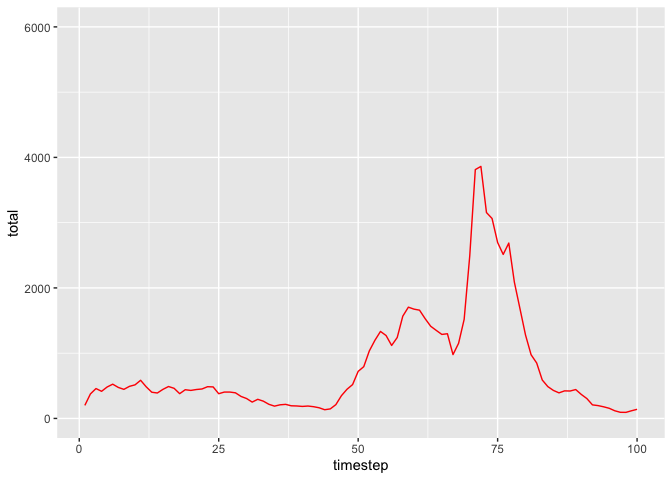

<!-- README.md is generated from README.Rmd. Please edit that file -->
colorednoise
============

[](https://cran.r-project.org/package=colorednoise) [](http://cran.rstudio.com/web/packages/colorednoise/index.html)

Overview
--------

Many populations that change over time are *temporally autocorrelated*, which means that the random noise in each timestep is correlated to that of the previous timestep. Instead of uncorrelated white noise, these populations are governed by blue noise (negatively autocorrelated) or red noise (positively autocorrelated.)

The colorednoise package allows you to simulate colored noise as well as populations whose behavior is governed by colored noise.

Installation
------------

You can install the latest version of colorednoise from github with:

``` r
# install.packages("devtools")
devtools::install_github("japilo/colorednoise")
```

Example
-------

Here are plots of some blue and red noise generated by the `raw_noise` function.

``` r
library(colorednoise)
blue_noise <- raw_noise(timesteps = 100, mu = 0.5, sigma = 0.4, phi = -0.5)
red_noise <- raw_noise(timesteps = 100, mu = 0.5, sigma = 0.4, phi = 0.5)
plot(x = 1:100, y = blue_noise, type = "l", col = "blue")
```


``` r
plot(x = 1:100, y = red_noise, type = "l", col = "red")
```


